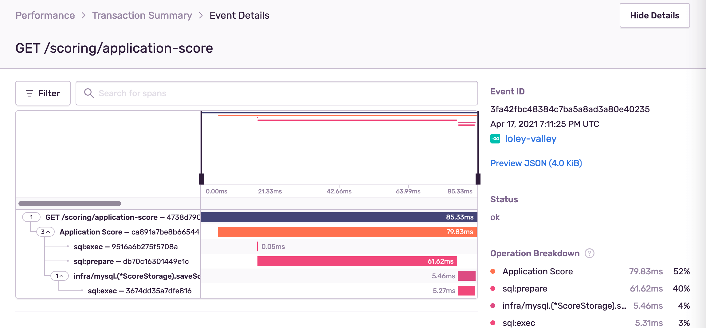

# sentry-go-exporter-opencensus

[](https://github.com/vearutop/sentry-go-exporter-opencensus/actions?query=branch%3Amaster+workflow%3Atest-unit)
[](https://codecov.io/gh/vearutop/sentry-go-exporter-opencensus)
[](https://pkg.go.dev/github.com/vearutop/sentry-go-exporter-opencensus)
[](https://wakatime.com/badge/github/vearutop/sentry-go-exporter-opencensus)


Provides [OpenCensus](https://github.com/opencensus-integrations) exporter support for [Sentry](https://sentry.io/).



OpenCensus has tracing instrumentations for a variety of technologies (databases, services, caches, etc...), this library
enables those instrumentations for Sentry performance tools with zero effort.

## Usage

```go
package main

import (
	"log"
	"time"

	sen "github.com/getsentry/sentry-go"
	"github.com/vearutop/sentry-go-exporter-opencensus"
	"go.opencensus.io/trace"
)

func main() {
	// Initialize Sentry.
	err := sen.Init(sen.ClientOptions{
		Dsn:        "https://abc123abc123abc123abc123@o123456.ingest.sentry.io/1234567",
		ServerName: "my-service",
		Release:    "v1.2.3",
	})
	if err != nil {
		log.Fatal(err)
	}

	defer func() {
		sen.Flush(time.Second)
	}()

	// Setup OC sampling.
	trace.ApplyConfig(trace.Config{
		DefaultSampler: trace.ProbabilitySampler(0.01),
	})

	// Enable Sentry exporter.
	trace.RegisterExporter(sentry.NewExporter())

	// Use OpenCensus integrations.
}

```